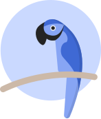

<h1 align="center">Parrot</h1>

<h4 align="center">Teach a virtual parrot as you learn a new language.</h4>

Welcome to Parrot, an open source project exploring the possibilities of using web technologies for learning languages and speech recognition.

## :rocket: Local development

Before you get started with local development you'll need to install and configure a few tools and services.

#### 1. Install yarn and node

The simplest way to do this is using Volta, a tool the helps manage node and yarn. You can find instructions on how to do that here: https://volta.sh/

#### 2. Install MongoDB

For local development we need a local instance of MongoDB, instructions available here: https://docs.mongodb.com/manual/installation/

\*Note: If you wish you can use an instance of MongoDB Atlas, a cloud hosted version of MongoDB. https://www.mongodb.com/cloud/atlas?tck=docs_server
